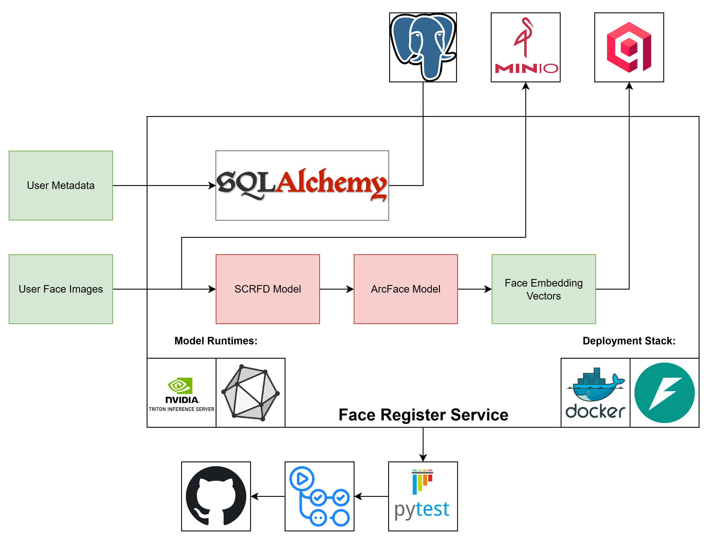

# Face Register Service

A face registration system for capturing user metadata and storing it in the database.



---

## 📖 Project Overview

Face Register is a FastAPI-based application that provides:

* **Face Detection & Recognition** with SCRFD + ArcFace (via ONNX Runtime)
* **User Management** with PostgreSQL + SQLAlchemy ORM
* **Vector Search** using Qdrant
* **Model & Image Storage** in MinIO
* **Database Versioning** with Alembic
* **Testing** with Pytest
* **Structured Logging** with custom logger
* **Service Orchestration** using Docker & Docker Compose

---

## ⚙️ Technology Stack

* **FastAPI** – Web framework for APIs, request handling, and docs
* **ONNX Runtime** – Runs SCRFD (face detection) and ArcFace (embedding) models
* **PostgreSQL** – Stores user profiles and metadata
* **SQLAlchemy** – ORM for database modeling and queries
* **Alembic** – Handles schema migrations and versioning
* **Pytest** – Test suite for validation and reliability
* **MinIO** – Stores face images and model files (S3 compatible)
* **Qdrant** – Vector database for face embedding similarity search
* **Custom Logger** – Structured logs with performance metrics
* **GitHub Actions** – Runs linting, tests, and builds on push/PR
* **Docker & Docker Compose** – Containerized setup for dev/test environments

---

## 🚀 Quick Start

1. **Clone and setup**:

   ```bash
   git clone <repository-url>
   cd face_register
   cp .env.example .env  # configure environment variables
   ```

2. **Start services**:

   ```bash
   ./scripts/dev-compose.sh
   ```

3. **Access the API**:

   * Swagger Docs: [http://localhost:8000/docs](http://localhost:8000/docs)
   * MinIO Console: [http://localhost:9001](http://localhost:9001)

---

## ✅ TODO

* [ ] Add **Continuous Deployment (CD)** pipeline
* [ ] Prepare **Production Deployment** configuration (security, scaling, monitoring)
* [ ] Serve models with Triton Server
